# PALM-GeM

**PALM-GeM** (Geospatial Data Merging and preprocessing into PALM) is a tool for preparing PALM CFD model *static driver* NetCDF files from open GIS data. It ingests UrbanAtlas, OpenStreetMap, and EU-DEM datasets into PostGIS and generates a ready-to-use static driver for PALM urban simulations at 5–10 m resolution, covering most larger European cities.

## Functionality

The static driver preparation workflow:

- **Domain definition** — specify center, extent, and resolution in UTM; PALM-GeM validates projection consistency
- **GIS import** — load UrbanAtlas, OSM vectors, and EU-DEM/building-height rasters into PostGIS via `ogr2ogr` / `raster2pgsql`
- **Landcover processing** — merge UrbanAtlas and OSM landcover into PALM surface types (vegetation, pavement, water, buildings)
- **Terrain and buildings** — process EU-DEM elevation and building height rasters onto the PALM grid
- **Trees** — compute leaf area density (LAD) / leaf area index (LAI) from individual tree data
- **Cut-cell topography** — optional slanted-face CCT extension for complex terrain
- **NetCDF output** — write a PALM-compliant static driver (and optional SLURB driver)

## Installation

See [docs/install.md](docs/install.md) for full setup instructions (PostgreSQL+PostGIS, GDAL tools, Python environment, SQL function loading).

Quick start:

```bash
python -m venv .venv && .venv/Scripts/activate    # Windows
pip install -r requirements.txt
cp .env.example .env                              # fill in DB credentials
docker compose up -d                              # start PostGIS (or use a native install)
python main.py -c config/user_config_palm.yaml
```

The `docker compose` step runs a PostGIS database in a container (auto-loading the
required extensions and SQL functions); the import tools still run on the host. To
install PostgreSQL natively instead, see [docs/install.md](docs/install.md).

## Documentation

| Topic | Link |
|-------|------|
| Tasks, pipeline & staged (multi-run) execution | [docs/tasks.md](docs/tasks.md) |
| Configuration reference | [docs/configuration_docs.md](docs/configuration_docs.md) |
| Running the preprocessor | [docs/run_preprocessor.md](docs/run_preprocessor.md) |
| Running the static driver generator | [docs/run_palm_static_driver.md](docs/run_palm_static_driver.md) |
| General architecture & log levels | [docs/general.md](docs/general.md) |
| QGIS visualization | [docs/visualization.md](docs/visualization.md) |
| Cut-cell topography | [docs/cut_cell_topo.md](docs/cut_cell_topo.md) |
| 3D buildings (LOD2) | [docs/buildings_3d.md](docs/buildings_3d.md) |
| Leaf area density | [docs/lad.md](docs/lad.md) |
| Surface fractions | [docs/surf_frac.md](docs/surf_frac.md) |
| Impervious surfaces | [docs/impervious.md](docs/impervious.md) |

## Examples

Working configurations for four European cities:

- [Berlin](examples/berlin/README.md)
- [Prague](examples/prague/README.md)
- [Brno](examples/brno/README.md)
- [Bergen](examples/bergen/README.md)
- [Prague LOD2](examples/prague_lod2/prague_lod2.md)

## Benchmark

| Domain | Size [km × km] | Grid | Time |
|--------|---------------|------|------|
| Brno | 0.64 × 0.64 | 64 × 64 | 12 s |
| Brno | 1.28 × 1.28 | 128 × 128 | 23 s |
| Brno | 2.56 × 2.56 | 256 × 256 | 117 s |
| Brno | 5.12 × 5.12 | 512 × 512 | 14.3 min |
| Bergen | 0.64 × 0.64 | 64 × 64 | 88 s |
| Bergen | 1.28 × 1.28 | 128 × 128 | 100 s |
| Bergen | 2.56 × 2.56 | 256 × 256 | 155 s |
| Bergen | 5.12 × 5.12 | 512 × 512 | 11 min |
| Bergen | 20.48 × 20.48 | 2048 × 2048 | 20 h |
| Berlin | 0.32 × 0.32 | 64 × 64 | 13 s |
| Berlin | 0.64 × 0.64 | 128 × 128 | 134 s |
| Berlin | 1.28 × 1.28 | 256 × 256 | 123 s |
| Berlin | 2.56 × 2.56 | 512 × 512 | 30 min |
| Berlin | 4.00 × 4.00 | 800 × 800 | 67 min |
| Prague LOD2 | 0.5 × 0.4 | 500 × 400 | 6 min |

## Example output

|  | Grid cell type | Terrain height | Building height |
|--|:-:|:-:|:-:|
| **Berlin** 4000 × 4000 m, 5 m | 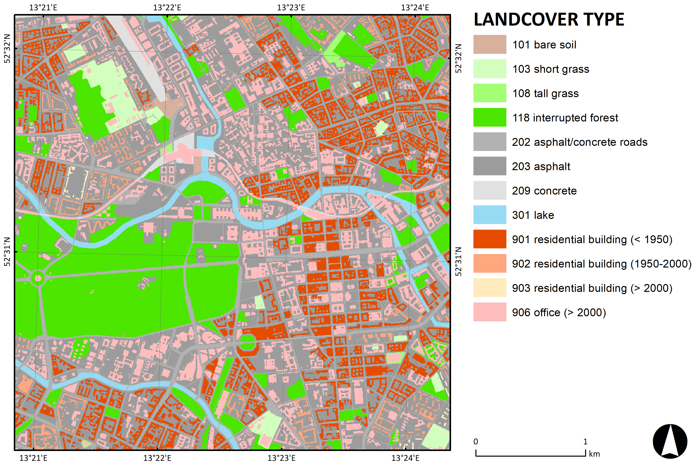 | 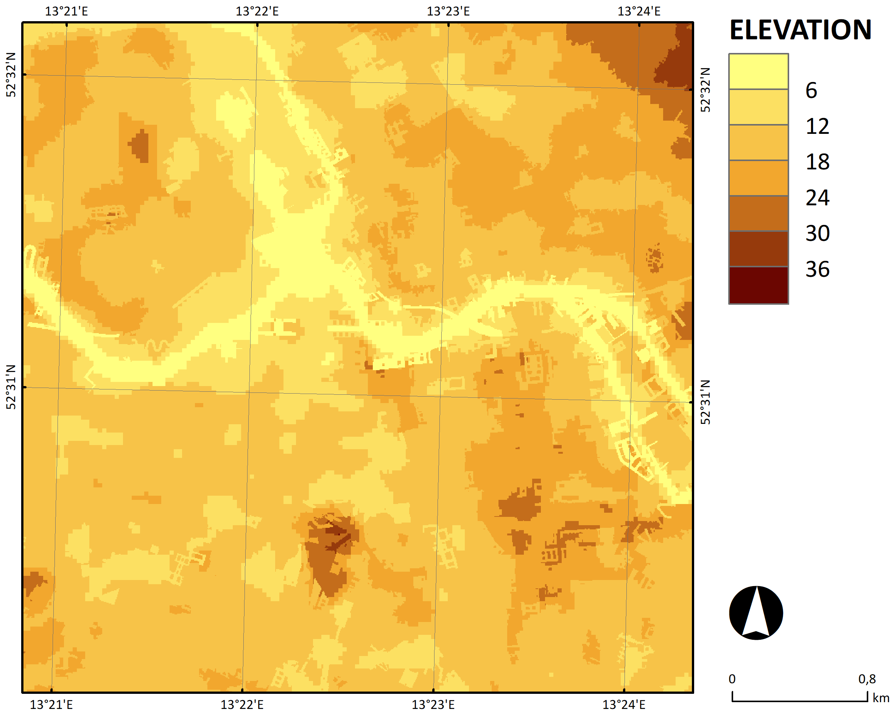 | 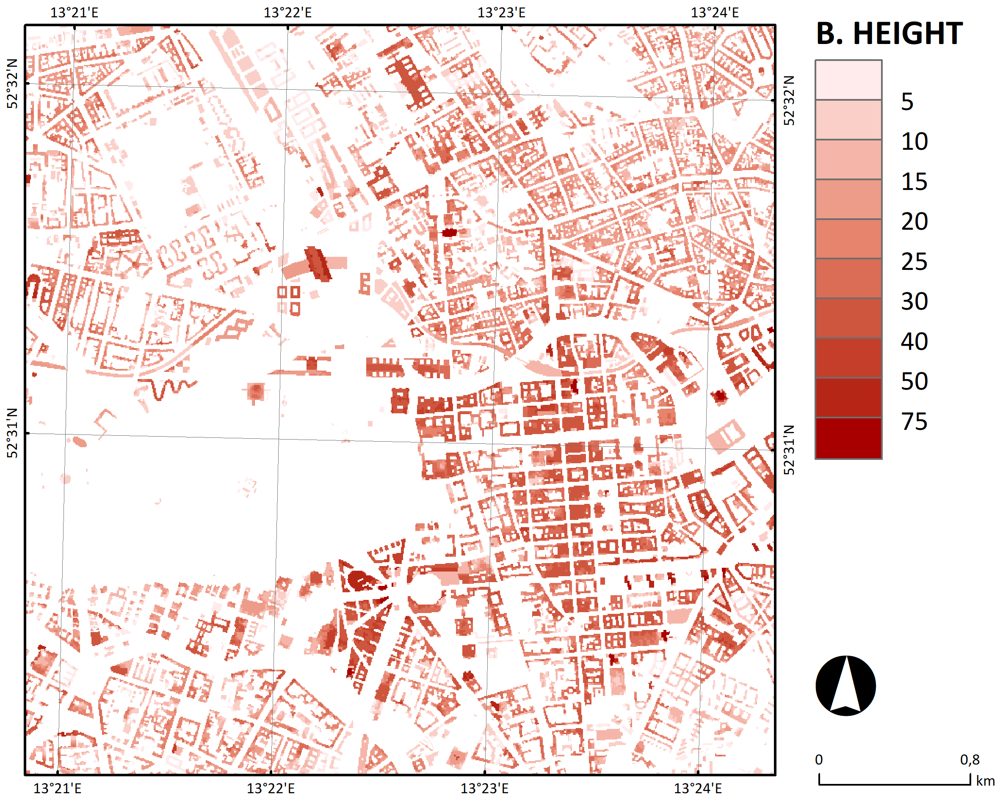 |
| **Prague** 2560 × 2560 m, 10 m | 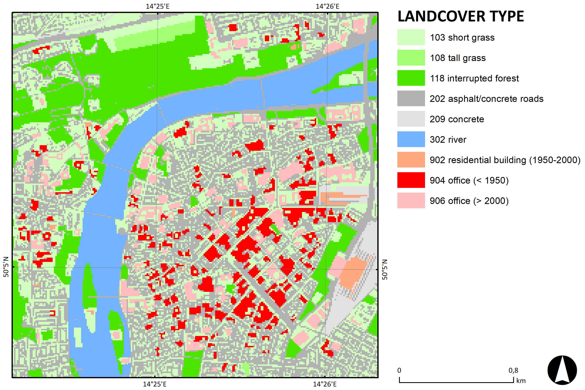 | 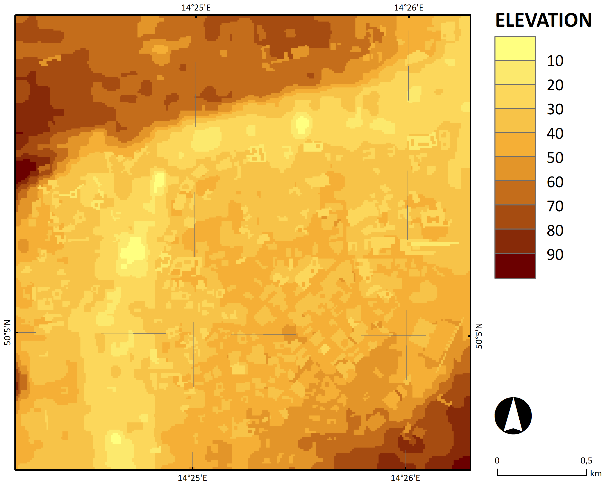 | 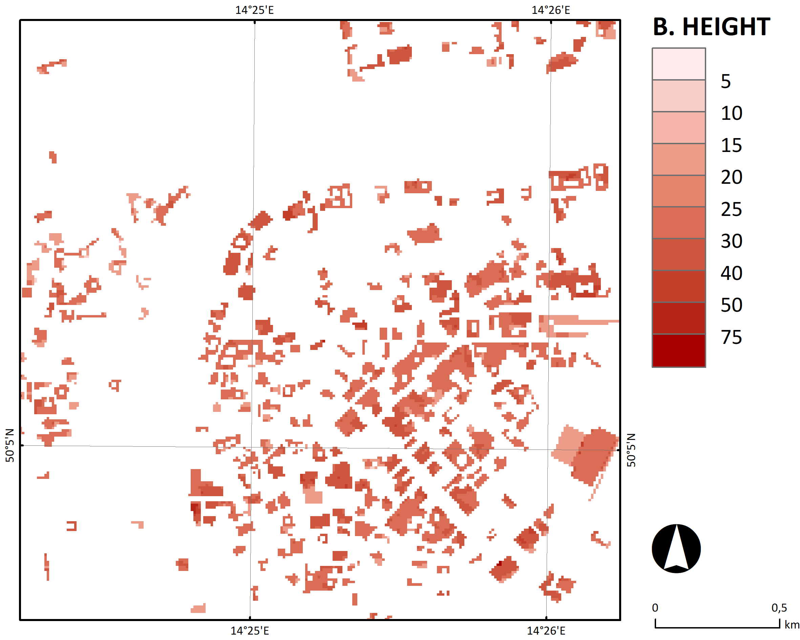 |
| **Brno** 5120 × 5120 m, 10 m | 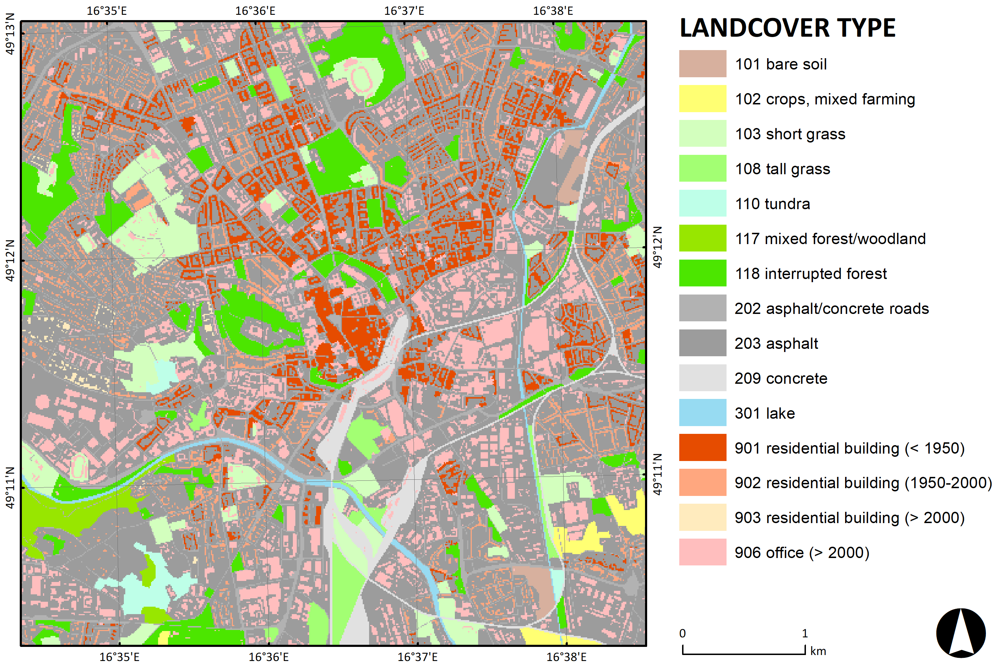 | 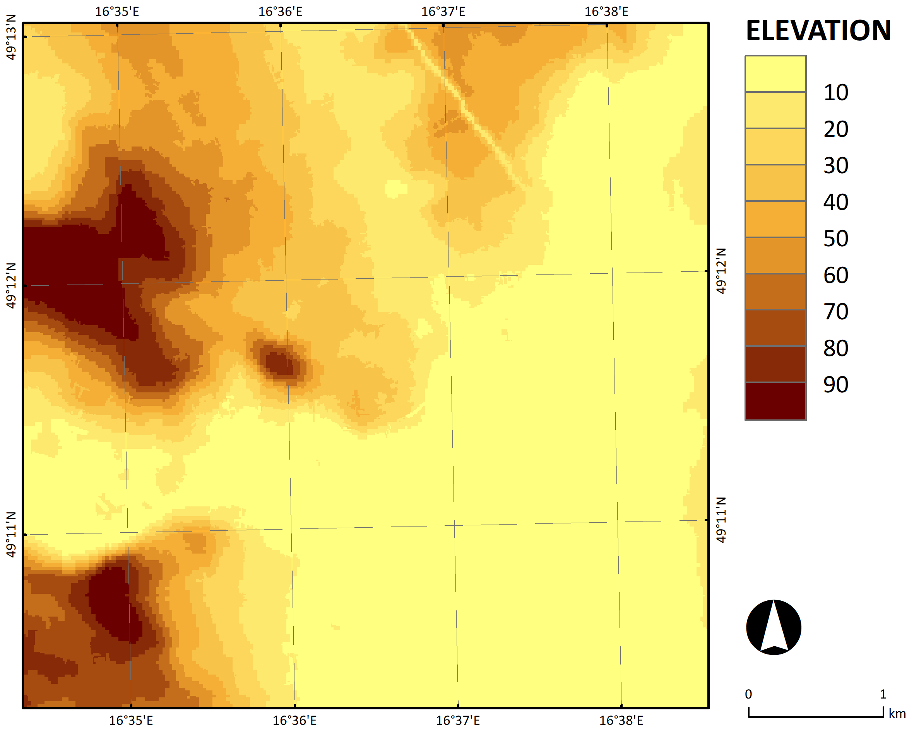 | 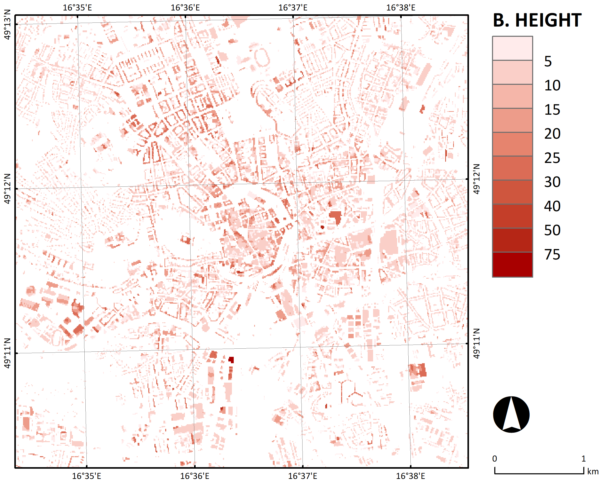 |
| **Bergen** 10 240 × 10 240 m, 10 m | 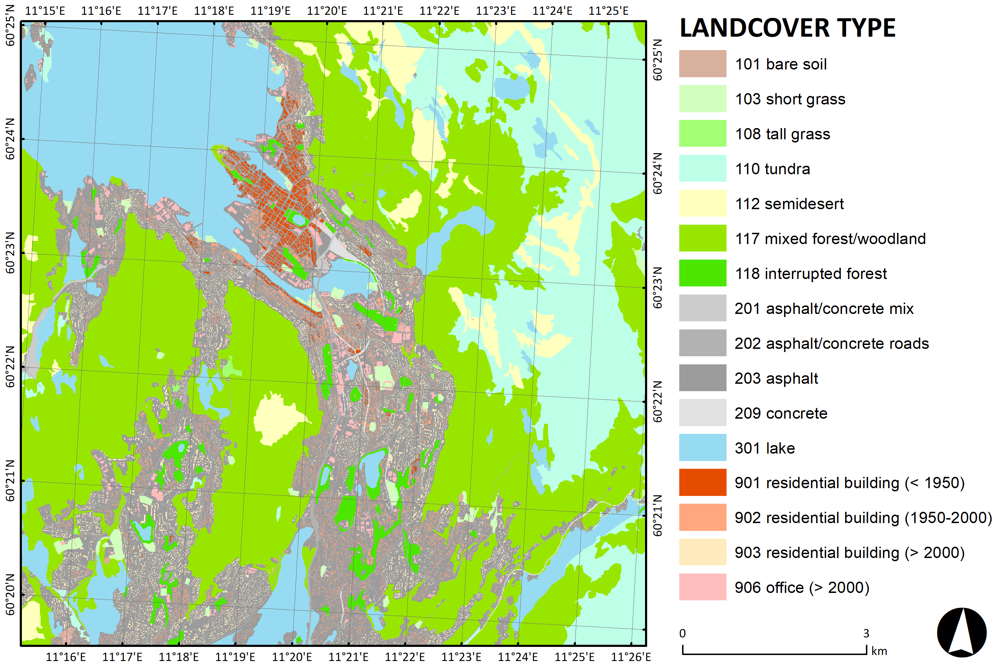 | 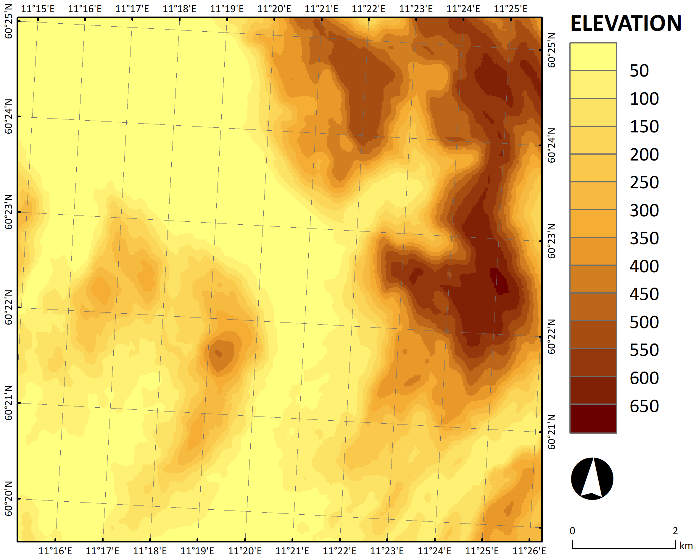 | — |

## Project status

PALM-GeM produces static drivers for most larger EU cities using UrbanAtlas + OSM + EU-DEM. Extensions include cut-cell topography (CCT), individual tree LAD, and LOD2-based detailed surface parameterization (vegetation, building materials, building surface parameters).

Known limitation: sub-grid [surface fractions](docs/surf_frac.md) are computed in PostGIS but not yet written to the static driver (PALM does not consume them yet).

## Contributing

To use custom datasets or request help with implementation, please open an issue or contact the authors.

## License

PALM-GeM is distributed under the GNU GPL v3+ license (see `LICENSE`).
Developed by the Institute of Computer Science of the Czech Academy of Sciences (ICS CAS).

## Acknowledgements

PALM-GeM was created with support from:

- [TURBAN: Turbulent-resolving urban modeling of air quality and thermal comfort](https://project-turban.eu/)
  (Technology Agency of the Czech Republic, [project TO01000219](https://starfos.tacr.cz/en/projekty/TO01000219))
- [CARMINE – Climate-Resilient Development Pathways in Metropolitan Regions of Europe](https://carmine-project.eu/)
  (European Commission, [project 101137851](https://cordis.europa.eu/projects/101137851))
